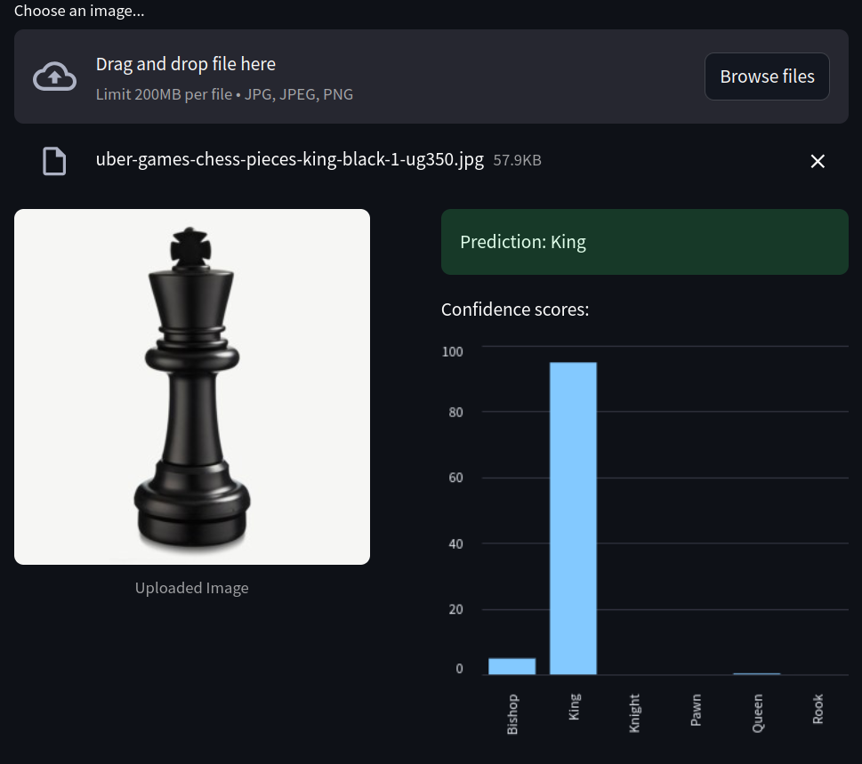

# Chess Piece Identifier

A deep learning application that identifies chess pieces from images using PyTorch and Streamlit.



## Overview

This project uses a Convolutional Neural Network (CNN) to classify chess pieces into six categories:
- Pawn
- Rook
- Knight
- Bishop
- Queen
- King

The model is built with PyTorch and deployed through a user-friendly Streamlit web interface.

## Features

- Upload your own chess piece images
- Real-time piece identification
- Confidence scores visualization for each prediction
- Simple and intuitive user interface

## Installation

1. Clone this repository:
```
git clone https://github.com/yourusername/chess-piece-identifier.git
cd chess-piece-identifier
```

2. Install the required packages:
```
pip install -r requirements.txt
```

3. Download the pre-trained model or train your own:
   - To use the pre-trained model, ensure `TheTrainedModel.pth` is in the root directory
   - To train your own model, prepare a dataset and run the training script

## Dataset Structure

To train the model, organize your chess piece images in the following structure:
```
Chess/
├── Bishop/
│   ├── bishop1.jpg
│   ├── bishop2.jpg
│   └── ...
├── King/
│   ├── king1.jpg
│   └── ...
├── Knight/
│   └── ...
├── Pawn/
│   └── ...
├── Queen/
│   └── ...
└── Rook/
    └── ...
```

## Usage

### Training the Model

To train the model on your own dataset:

```python
from chess_piece_identifier import load_or_train_model

# Path to your dataset
dataset_path = 'path/to/Chess'
model, device, class_names = load_or_train_model(dataset_path)
```

### Running the Streamlit App

Run the following command to start the Streamlit interface:

```
streamlit run app.py
```

The app will open in your default web browser. Upload an image of a chess piece, and the model will predict which piece it is, along with confidence scores.

## Model Architecture

The chess piece classifier uses a CNN with the following architecture:
- Three convolutional blocks with batch normalization and max pooling
- Fully connected layers with dropout to prevent overfitting
- Input images are resized to 224×224 pixels and converted to 3-channel grayscale


## Contributing

Contributions are welcome! Please feel free to submit a Pull Request.

